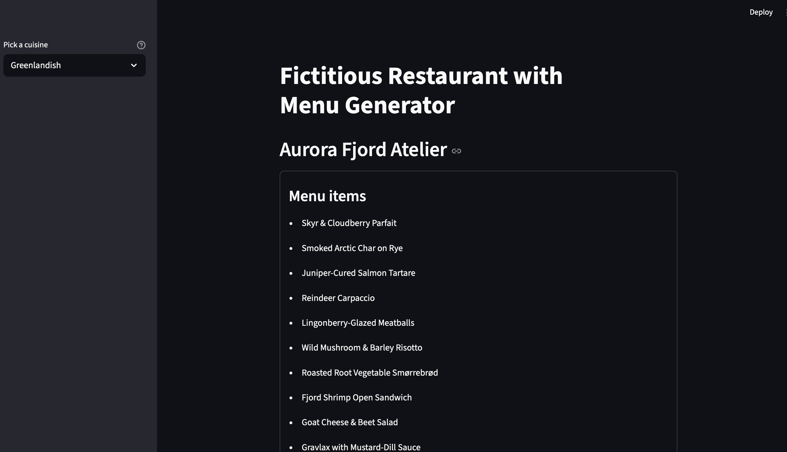

# Fictitious Restaurant Name & Menu Generator (LLM)




An LLM-powered application that generates **creative restaurant names and sample menus** based on the cuisine type and theme (e.g., Indian, Italian, Japanese, fine-dining, casual, street-style).

---

## 🍽️ Problem Statement

Creating a unique restaurant identity requires:
- A compelling name
- A cuisine-appropriate menu
- Consistent theme and tone

This process is often manual and subjective, making rapid ideation difficult.

---

## 💡 Solution

This project uses a Large Language Model (LLM) to generate:
- **Fictitious restaurant names**
- **Cuisine-specific menus**
- **Thematically consistent dish names**

The generation is controlled via structured prompts to ensure realism and cuisine relevance.

---

## 🧠 Key Capabilities

- 🏷️ Creative restaurant name generation  
- 📜 Menu creation tailored to cuisine type  
- 🌍 Supports multiple cuisines (Indian, Italian, Japanese, etc.)  
- 🎨 Theme-aware generation (fine dining, casual, street food)  
- ⚙️ Deterministic or creative outputs via temperature control  

---

## 🏗️ Architecture Overview


---

## 📌 Example Inputs

- Cuisine: `Indian`
- Cuisine: `Italian`
- Cuisine: `Japanese`

---

## 📌 Example Output

```
Restaurant Name: Saffron Ember
Menu:
Kashmiri Rogan Josh
Smoked Dal Makhani
Saffron-Infused Basmati Rice
Pistachio Kulfi
```

---

## 🛠️ Tech Stack

- **Language**: Python  
- **LLM**: API-based Large Language Model  
- **Prompting**: Structured prompt templates  
- **Design Focus**: Controlled creative generation

---

## 📂 Project Structure

```text
Root
├──Fictitious_restaurant_with_menu/
    ├── backend/
    │   ├── restaurant_and_menu_generator_server.py
    │   └── API_keys.py
    ├── frontend/
    │   ├── app.py   
    └── README.md
```

---
## ⚙️ Installation & Setup

- **Create and activate virtual environment**
  - 
      python -m venv .venv
      source .venv/bin/activate   # macOS / Linux
      .venv\Scripts\activate      # Windows
- **Install Dependencies**
  - 
      pip install -r requirements.txt
- **Configure Environment Variables**
  -
  
      OPENAI_API_KEY=your_llm_api_key
      DB_USER=your_db_user
      DB_PASSWORD=your_db_password
      DB_HOST=localhost
      DB_PORT=3306
      DB_NAME=atliq_tshirts

- **Run the application from the project root**
  - 
      python -m streamlit run Fictitious_restaurant_with_menu/frontend/app.py
---