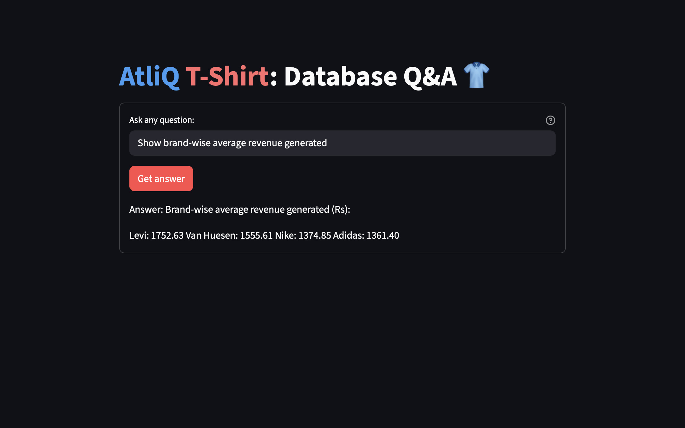

# SQL RAG Agent – AtliQ T-Shirts Retail Analytics




An LLM-powered **SQL + Retrieval-Augmented Generation (RAG) agent** that answers natural language questions over a retail database for a fictitious apparel company, **AtliQ T-Shirts**.

The agent translates user questions into optimized SQL queries, executes them safely, and returns **business-friendly answers** grounded in actual database results.

---

## 🏪 Business Context

AtliQ T-Shirts is a fictional retail brand selling T-shirts across multiple brands, sizes, colors, and price points.  
Discounts are applied at the brand level and may or may not be present for every product.

Business users often need quick answers such as:
- “Which T-shirt has the lowest discount?”
- “What is the total revenue for Levi brand?”
- “Which products are currently in stock?”
- “How do discounts affect total revenue?”

---

## 🗄️ Database Schema

### **product**
- brand  
- color  
- size  
- stock_quantity  
- price  

### **discount**
- brand  
- pct_discount  

Discounts are optional and applied per brand.

---

## 🧠 Solution Overview

This project uses an **LLM-powered SQL agent with RAG** to:
1. Understand natural language retail queries
2. Retrieve relevant schema and rules
3. Generate safe, optimized SQL queries
4. Execute queries on the database
5. Return concise, human-readable answers

The RAG layer ensures that the LLM is **grounded in schema knowledge and business rules**, reducing hallucinations and improving accuracy.

---

## 🏗️ Architecture Overview

```text
User Query
│
▼
Schema & Rule Retrieval (RAG)
│
▼
SQL Generation (LLM)
│
▼
SQL Execution (Read-Only)
│
▼
Structured Results
│
▼
Natural Language Answer
```


---

## ✨ Key Capabilities

- 🔍 Natural language → SQL translation  
- 🧮 Revenue and inventory analytics  
- 🧩 Correct handling of optional discounts  
- 🚫 No `SELECT *` or unnecessary columns  
- 🔐 Read-only, safe query execution  
- 📊 Business-focused responses (no internal IDs)

---

## 📌 Example Questions

- “What is the total revenue for Levi T-shirts?”
- “Which T-shirt has the lowest discount?”
- “List available T-shirts that are in stock.”
- “How much revenue comes from discounted products only?”

---

## 🛠️ Tech Stack

- **Language**: Python  
- **Database**: MySQL / SQLite  
- **LLM**: API-based Large Language Model  
- **Agent Framework**: Tool-using SQL agent  
- **Output Handling**: Structured (Pydantic-based) responses  
- **Design Pattern**: SQL + RAG

---

## ⚙️ Installation & Setup

- **Create and activate virtual environment**
  - 
      python -m venv .venv
      source .venv/bin/activate   # macOS / Linux
      .venv\Scripts\activate      # Windows
- **Install Dependencies**
  - 
      pip install -r requirements.txt
- **Configure Environment Variables**
  -
  
      OPENAI_API_KEY=your_llm_api_key
      DB_USER=your_db_user
      DB_PASSWORD=your_db_password
      DB_HOST=localhost
      DB_PORT=3306
      DB_NAME=atliq_tshirts
      
- **Initialise the database**
  - 
      mysql -u your_user -p atliq_tshirts < database/schema.sql

- **Run the application from the frontend directory**
  - 
      streamlit run app.py


---

## 📂 Project Structure

```text
SQL_agent/
├── backend/
│   └── sql_agent.sql
├── frontend/
│   ├── app.py
└── README.md
```

## 📈 Future Enhancements

- Speech to text conversion
- Support multi-table joins beyond discounts